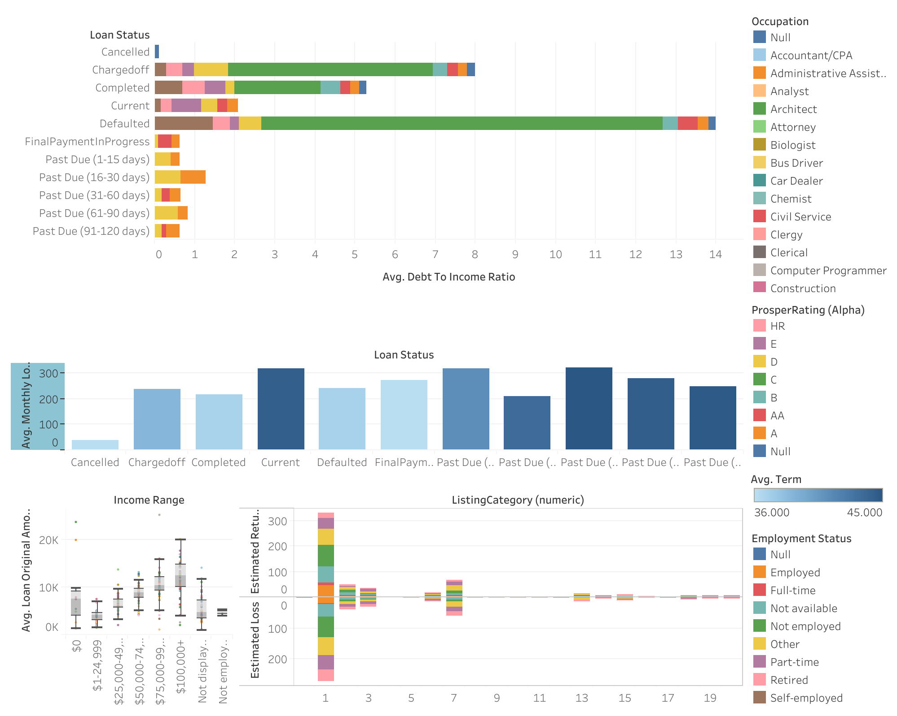

# Tableau_labProject
## Data Presentation using Tableau on a Loans dataset
### This project involves providing recommendations, on how to mitigate the risk of defaults,for a peer to peer money market application. 

## Background
Led by a team with experience in running technology projects in the financial and education sector, they are develiping an app that integrates the power of crowdfunding. The app being a market place for lending and borrowing money provides an automated matching of a borrowing and lending request with money being disbursed within seconds to a borrower's account.

## Dataset
The loan data set contains 113,937 loans with 81 variables on each loan, including loan amount, borrower rate (or interest rate), current loan status, borrower income, and many others.

## Findings and recommendations
The biggest defaulters fall within the unemployed category of clients. There is also a very strong positive relationship between these three varibles; being unemployed, having a large debt-to-income ratio, and defaulting. Therefore while it would seemingly be discriminatory, and even borderline unethical, to deny clients loans because they are unemployed, it would nonetheless be critical to check if they have a signficant debt-to-income ratio.
On average, loans that are past their due date have higher terms of payments and a high montly loan payment. Loans that are completed in due time have relatively low terms of payment and relatiely lower montly loan payments. The loan app, therefore, should give more loans with lower terms and lower montly loan payments using less stringent risk evaluation compared to loans with longer terms and higher montly payments.
There is a strong relationship between original loan amount taken by a borrower and their income level/range. 
Loans with the highest estimated returns are taken by borrowers whose loans are listed under debt consolidation, then Other, then Home Improvement, then Business. However these loans also bear the highest estimated losses in the same order. However, the net profit is positive due to the higher net profit in the debt consolidation listing. 

## Tableau dashboard graphics 
[Infographics](https://public.tableau.com/app/profile/david.githaiga6232/viz/Loansdataset/Dashboard1#guest=n)

